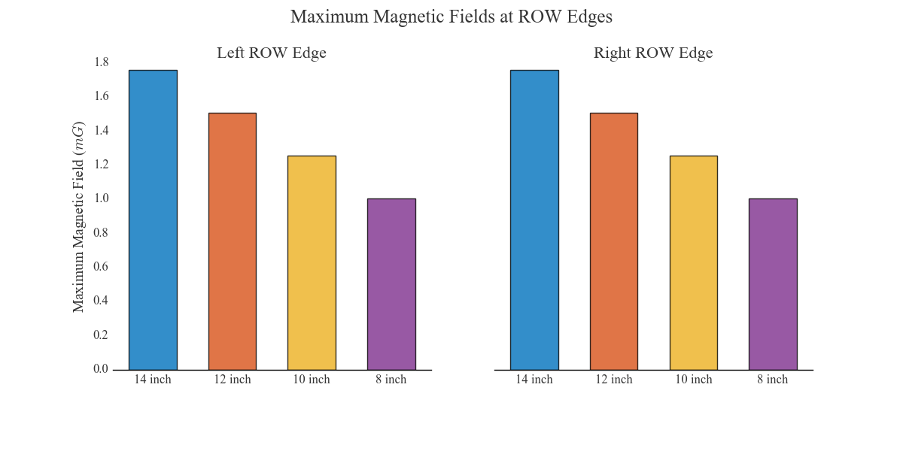

# `emf`

The `emf` package is a container for two subpackages:

1. `emf.fields` was originally a small stand-alone package that streamlined the use of an old elecromagnetic field (EMF) modeling program called FIELDS, which predicts electric and magnetic fields near parallel sets of power lines by assuming the conductors are infinitely long and computing the fields along a transect perpendicular to the power lines (a cross section model). The old FIELDS program is very difficult to use (details on why below), so it made sense to transplant as much of the modeling process as possible into other programs. Initially, to compute a cross section model, `emf.fields` would read power line information from excel templates, create the input files necessary to run the data through FIELDS, then read the FIELDS output files to provide plots, exports, etc. The package did everything except perform the actual EMF calculations. At this point `emf.fields` does everything the old FIELDS program does, including the EMF calculations, and more. See more on `emf.fields` below.

2. `emf.subcalc` is currently similar to the original versions of `emf.fields`, because it supplements and streamlines another modeling program without fully replacing it. In this case, the other modeling program is [SUBCALC](http://www.enertech.net/html/emfw.html) (developed by [Enertech](http://www.enertech.net/html/emfw.html), sponsored by [EPRI](http://www.epri.com)), which predicts EMF over a fixed height 2 dimensional grid and can model many non-parellel groups of power lines. `emf.subcalc` reads the text file output of SUBCALC models and provides methods to associate the results with `Footprint` objects (simple outlines of nearby objects in the model domain like houses), plot the results, convert results to excel files (much smaller file size), and interpolate the grid (at points, along lines, or complete resampling). It would be nice to build the calculations into `emf.subcalc` and totally replace SUBCALC, but that hasn't been done yet.

### `emf.fields` vs FIELDS

The `emf.fields` subpackage contains code that calculates theoretical electric and magnetic fields near parallel groups of power lines. It replaces the old and difficult program called FIELDS, originally developed by [Southern California Edison Co.](https://www.sce.com). The FIELDS software runs through a DOSBOX application and is long out of date.

The main problems with FIELDS:
* Using the program requires navigating through lots of menus with semi-responsive buttons, requiring manual entry of cross section data into menus and tables of the DOSBOX app without even the option to copy and paste. Building cross section models in FIELDS is slow, tedious, and error prone.
* Once a cross section is built in FIELDS, it's very difficult to refer to the input data because FIELDS saves model information to nearly inscrutable text files with `.FLD` extensions. These files also force users to re-navigate the frustrating series of menus to edit cross section input.
* Causing further annoyance, the program traps the mouse, meaning other applications can't be used at the same time unless an escape button is pressed first (the Windows button on Windows).
* Results are output to delimited files with `.DAT` extensions, but these files contain results rounded/truncated to three digits and often have formatting complications or printing errors. For example, numbers that require more than four digits to the left of a decimal (including negative signs, like -1233.0) are printed on their own lines with "%" in front of them for some reason.
* Nothing is scriptable. Any changes require re-naviating the menus, `.FLD` files, and `.DAT` files.

FIELDS is useful for performing the EMF calculations, but the rest of the program is an impediment.

`emf.fields` performs the same calculations as FIELDS, but removes the frustrating issues listed above (for a person who knows some Python). The FIELDS source code isn't released, so a line-by-line replication of its calculations isn't possible, but `emf.fields` produces nearly identical results for the same input. The calculations follow the conceptual guidelines laid out in the Electric Power Research Institute's "Red Book" (some more information on this source below).

Comparisons between FIELDS results and `emf.fields` results have shown error on the order of floating point roundoff in almost all cases. The plot below shows FIELDS results and results of this code for the same cross section. They can't be distinguished by eye and the error is clearly not systematic.

`emf.fields` also reproduces nearly identical results for underground conductors, as shown below.

An engineer on the team that originally developed FIELDS said that the FIELDS program runs 16-bit BASIC, lower precision than modern languages, and that BASIC has known accuracy issues with the sine and cosine functions (used at several points in the calculations). Additionally, because the results of FIELDS simulations are saved to output files with the values rounded or truncated to the thousandths digit, significant precision can be lost. Thus far, all discrepancies between FIELDS results and the results of `emf.fields` can reasonably be attributed to rounding in the FIELDS results when the field magnitudes are low and possibly to trigonometry inaccuracies in BASIC.

### Using `emf.fields`

For modeling batches of cross sections, this code enables a one line effort (after filling in template excel sheets) to generate:
* full sets of electric and magnetic field results along each cross section
* a table of maximum field magnitudes at the right-of-way (ROW) edges of each cross-section
* double-axis plots of both electric and magnetic fields
* plots comparing the electric and magnetic fields of grouped cross sections over their entire domain
* bar charts showing the fields of grouped cross sections at ROW edges.

The `run()` function does all of that and only requires the path of an excel workbook of templates. Blank templates can be copied out of the package with `emf.drop_template()`. Alternatively, cross section models can be built entirely in Python, as [this notebook]('docs/fields-workflow-from-scratch.ipynb') demonstrates.

Fine control of the models is also entirely available. `emf.fields` uses three classes to organize models:
* `Conductor` - Low level class representing a single power line (or conductor bundle) and storing fundamental information like position, voltage, etc.
* `CrossSection` - Stores and organizes groups of `Conductor` objects, providing dictionary-like access to them. Also stores modeling information like step size, model extents, etc., as well as the results of EMF calculations (in [DataFrames](http://pandas.pydata.org/pandas-docs/stable/generated/pandas.DataFrame.html)).
* `SectionBook` - Top level class storing `CrossSection` objects and providing dictionary-like access to them, as well as

In addition to being quicker to use and more flexible than FIELDS, this code supplements the analytical capabilities of FIELDS with two methods.
* `emf.fields.optimize_phasing()` optimizes the phasing arrangement of selected conductors in a cross section by calculating fields for every possible phasing permutation at the ROW edges. Conductors can be grouped arbitrarily into circuits (usually groups of three for three phase circuits). Because this method performs brute force testing of the ROW edge fields for all possible permutations and scales poorly, this method is slow when optimizing more than about five (three phase) circuits at a time, but CrossSections with more than a few circuits are very rare.
* `emf.fields.target_fields()` finds any additional conductor height needed to bring maximum fields down to target levels. This method also allows for selection of specific conductors and uses a simple root finding method, increasing the height of selected conductors and reevaluating theoretical fields at right-of-way (ROW) edges until desired precision is achieved.

#### Example Plots

Simulated maximum electric and magnetic fields across a ROW, with the field magnitudes on split vertical axes, using `emf.fields.plot_max_fields()`. Conductor positions are shown in true horizontal units but false/scaled vertical units:

Comparison of simulated magnetic field profiles of two related cross sections, essentially a before-after plot, using `emf.fields.plot_groups()`. Switching the rightmost circuit to a "delta" configuration reduces fields significantly:

A plot showing how simulated magnetic fields at ROW edges decrease when the
spacing between conductors in the "delta" configuration is decreased:

Contour plot of SubCalc magnetic field results and structures of interest using `emf.subcalc.plot_contours()`, where the contours are colored on a logarithmic scale using the "viridis" colormap:

Contour plot of the same SubCalc results from above, using `emf.subcalc.plot_contours()`, but with contours colored on a linear scale using the "viridis" colormap again:

A heatmap or colormesh plot of the same SubCalc results again, using `emf.subcalc.plot_pcolormesh()`:

Another heatmap using results from the same model as above, but with only the
horizontal (x) component of the magnetic field plotted, and using the "magma" colormap.

###### EPRI's "Red Book"

The editon of [EPRI](http://www.epri.com)'s "Red Book" that I worked from to replicate FIELDS calculations is titled "Transmission Line Reference Book: 345 kV and Above, Second Edition." Section 8.3 outlines the calculation of electric fields. Section 8.4 outlines the calculation of magnetic fields. Appendix 8.1 details how to calculate the maximum field magnitude from horizontal and vertical component phasors, which might sound almost trivial but is more involved than expected.

###### Other Things

`emf` has mostly been used with Python 2.7. At different points it has been used compatibly with Python 3.x, but

###### Python Package Dependencies
* `os`
* `copy`
* `glob`
* `shutil`
* `numpy`
* `scipy`
* `pandas`
* `textwrap`
* `itertools`
* `matplotlib`
