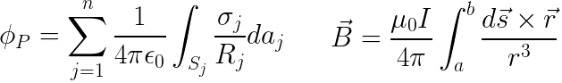

# `emf`

The `emf` package is a container for two subpackages (documentation accessible [here](docs/index.html)). The subpackages, called `fields` and `subcalc`, are for modeling electric and magnetic fields near power lines. The `fields` subpackage is for 2D models. It predicts electric and magnetic fields near sets of parallel power lines. The `subcalc` package is for 3D models, predicting the magnetic fields generated by complex, nonparallel collections of current carrying wire segments. Both subpackages are freestanding, meaning they can be used to build, compute, and analyze models without any other programs. They rely heavily on `numpy`, `pandas`, and `matplotlib`, but the EMF calculations do not rely on algorithms from any external libraries or legacy code. For 2D models in `emf.fields`, the fields calculations are done only in Python. For 3D models in `emf.subcalc`, a [C module](emf/subcalc/lift/lift.c) was developed to speed up the intensive number crunching.

Both `fields` and `subcalc` were originally meant to supplement older modeling programs and eventually became complete replacements of them. Thus, both packages are styled after the older programs and still contain a fair amount of functionality for working with those programs. Both `fields` and `subcalc` also have specially formatted excel/csv [templates](emf/templates) for storing input data. Although these template files are never strictly necessary, they make the packages much more usable for those who only know a little bit of Python and they make larger-scale modeling projects more repeatable and easier to check for errors. Neither package has a UI, just scripts and (optionally) template files.

### `emf.fields` resources

* [Further discussion](docs/README-fields.html)
* [Documentation](docs/emf.fields.html)
* [Tutorial - `fields` modeling from scratch](docs/fields-workflow-from-scratch.html)
* [Example - optimizing underground circuits](docs/underground-line-optimization.html)
* [Example - using a `fields` template](docs/using-a-template.html)

### `emf.subcalc` resources

* [Further discussion](docs/README-subcalc.html)
* [Documentation](docs/emf.subcalc.html)
* [Tutorial - build a model, compute results, and make plots](docs/small-model-tutorial.html)
* [Example - using `emf.subcalc` templates](docs/tower-and-footprint-templates.html)
* [Example - sampling `Model` objects](docs/sampling-model-objects.html)

##### Notes

`emf` has mostly been used with Python 2.7. Early on it was used compatibly with Python 3.x, but compatibility hasn't been checked for a while.

##### Python Package Dependencies
`os`, `copy`, `numpy`, `scipy`, `ctypes`, `shutil`, `pandas`, `textwrap`, `itertools`, `matplotlib`
