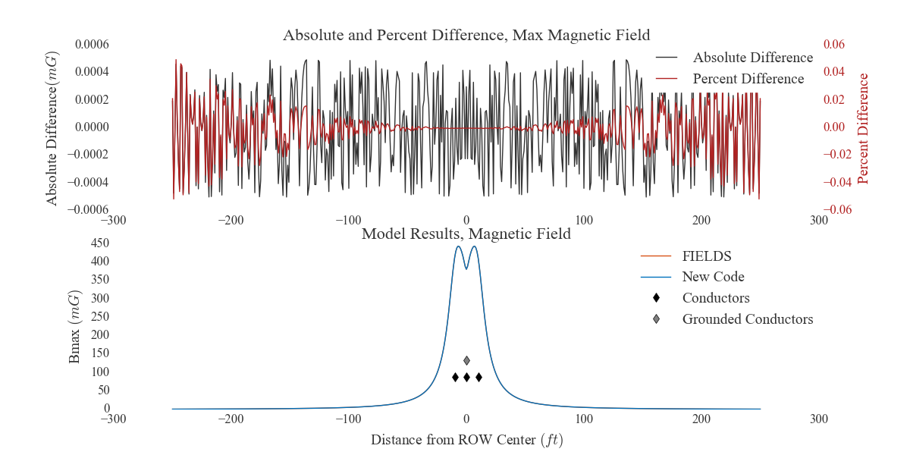
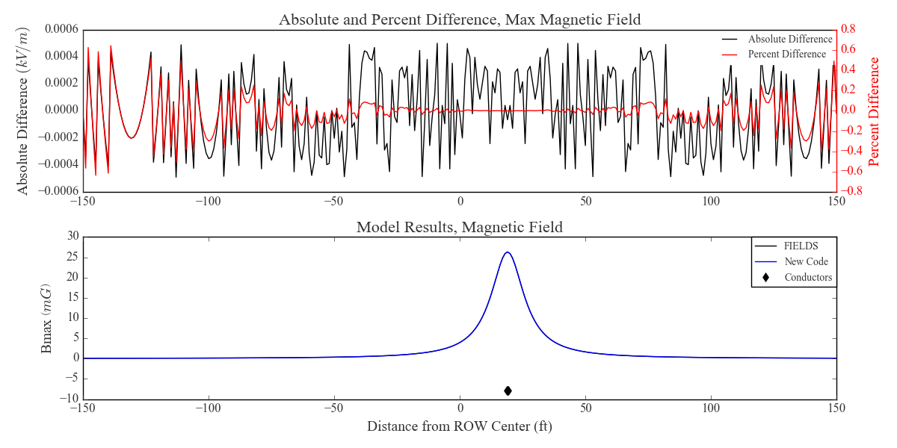
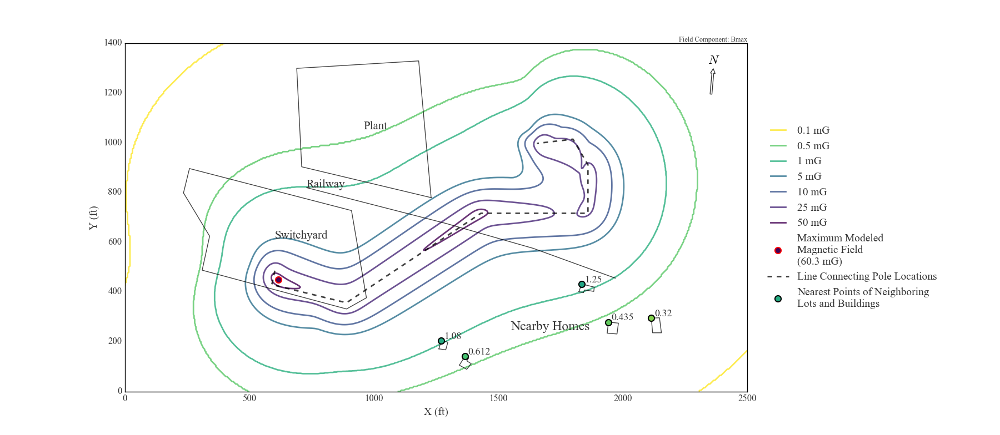
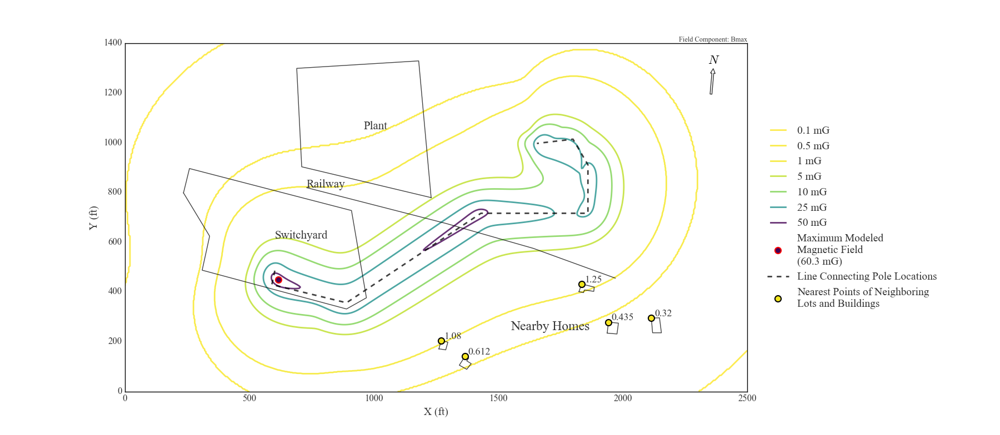
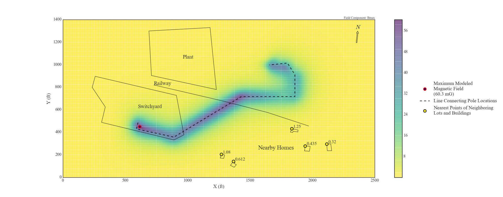
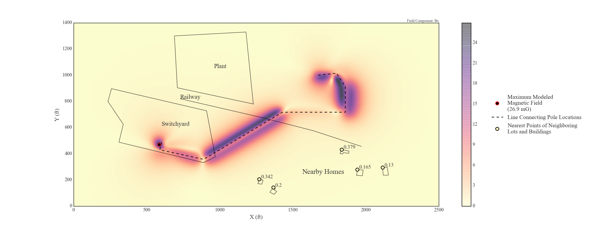

# `emf`

The `emf` package contains two subpackages:
* `emf.fields` - Originally meant to streamline input/output and analysis of data used by the `FIELDS` program (discussed below), this package is now a wholesale replacement and extension of `FIELDS`. The `emf.fields` package:
  * reads data from excel templates and calculates theoretical electric and magnetic fields in the vicinity of parallel sets of power lines
  * has functions to optimize the phasing of power line cross sections, generate plots of results, and calculate any additional power line height required to reduce fields to target values (like regulatory limits)
  * extends the capabilities of the old `FIELDS` program but still provides tools to make working with `FIELDS` faster and less error prone
* `emf.subcalc` - This package manages the results of emf simulations performed by the SubCalc program (developed by [Enertech](http://www.enertech.net/html/emfw.html), sponsored by [EPRI](http://www.epri.com)), which calculates fields near non-parallel sets of power lines like those that occur in electrical substations. The `emf.subcalc` package:
  * reads the text file output of the SubCalc program (which are saved to `REF` files by default) and converts the results to 2D grid arrays stored in a `Model` object, using `subcalc.load_model`
  * uses bilinear interpolation to approximate fields anywhere inside the grid of SubCalc results
  * generates contour and heatmap figures of the results
  * stores the coordinates of footprints in the model domain (like nearby structures, roads, and the modeled power lines) and automatically draws and annotates the footprints in plots
  * saves results to excel files much smaller than the SubCalc output files (one instance reduced the file size by a factor of 6) using `subcalc.Model.export` or simply `subcalc.convert_REF`. Results exported to excel can be loaded back into a `Model` object with the same function as that which loads from `REF` output files (the `subcalc.load_model` function)

### `emf.fields` vs ``FIELDS``: Computing Electric and Magnetic Fields Near Parallel Sets of High Voltage Transmission Lines

The `emf.fields` subpackage contains code for the approximation of electric and magnetic fields near parallel groups of power lines. It's meant to replace the old and difficult program called `FIELDS`, originally developed by Southern California Edison Co., which has been a standard tool for these simple modeling efforts. The `FIELDS` software runs through a DOSBOX application and is long out of date.

The main problems with `FIELDS`:
* Using the program requires navigating through lots of menus with semi-functional buttons.
* The program traps the mouse, meaning other applications can't be used at the same time unless an escape button is pressed first (the Windows button on Windows).
* `FIELDS` requires manually entering cross section data into menus and tables of the DOSBOX app without even the ability to copy and paste. It's slow, tedious, and error-prone.
* Results are output to files with `DAT` extensions. The `DAT` files contain results rounded/truncated to three digits and often have formatting complications or printing errors if distance values are too large. Numbers that require more than four digits to the left of a decimal (including negative signs) are printed on their own lines with "%" in front of them for some reason.
  * `emf.fields.read_DAT` can deal with the printing issues and the fact that cross sections with exclusively underground lines yield `DAT` files without any electric field columns. The function reads `DAT` files into [`pandas`](http://pandas.pydata.org/pandas-docs/stable/index.html) DataFrames.
* `FIELDS` gives you the option to save cross section data, but it simply writes information to an inscrutable text file with an `FLD` extension for later retrieval, so the data can be stored, but not in an editable form.
* Nothing is scriptable. Changes require re-naviating the menus, `DAT` files, and `FLD` files.
`FIELDS` is only useful for performing the calculations, but the rest of the program is an impediment.

This code is intended to exactly replicate the results of `FIELDS` calculations but remove all of the frustrating parts (for someone who knows a little Python). The calculations follow the conceptual guidelines laid out in the Electric Power Research Institute's "Red Book" (some more information on this source below), but the `FIELDS` source code isn't released, so a line-by-line replication of the calculations isn't possible. However, this version of the code has been able to reproduce `FIELDS` results to a very high degree of accuracy.

Comparisons between `FIELDS` results and the results of this code have shown error on the order of floating point roundoff in almost all cases. The plot below shows `FIELDS` results and results of this code for the same cross section. They can't be distinguished by eye and the error is clearly not systematic for overhead lines:

or for underground lines:

An engineer on the team that originally developed `FIELDS` said that the `FIELDS` program runs 16-bit `BASIC`, lower precision than modern languages, and that BASIC has known accuracy issues with the sine and cosine functions (used at several points in the calculations). Additionally, the results of `FIELDS` simulations are saved to output files with the values rounded or truncated to the thousandths digit. Thus far, all discrepancies between `FIELDS` results and the results of this code can reasonably be attributed to rounding in the `FIELDS` results when the field magnitudes are low and possibly to trigonometry inaccuracies in `BASIC`.

The `FIELDS` method of calculating EMF near transmission lines is not improved by this code. It seems like the `FIELDS` approach has inertia and is considered the standard tool. However, this code does significantly improve upon the usability and analytical capabilities of `FIELDS` by making the functions that calculate electric and magnetic fields accessible and building methods around them. This code mainly relies on:
* [data structures](http://pandas.pydata.org/pandas-docs/stable/dsintro.html#dataframe) and [I/O methods](http://pandas.pydata.org/pandas-docs/stable/io.html) from [`pandas`](http://pandas.pydata.org/pandas-docs/stable/index.html) to interface with excel templates, store the results of fields simulations, and write results to output files
* [`numpy`](http://www.numpy.org/) arrays and functions to perform the actual fields calculations
* [`matplotlib`](http://matplotlib.org/) to generate plots of the simulation results
* three classes (`Conductor`, `CrossSection`, and `SectionBook`) to organize/manipulate the imported data and the EMF results.

For the most routine modeling scenarios, this code enables a one line effort (after filling in template excel sheets) to generate full sets of electric and magnetic field results, double-axis plots of both electric and magnetic fields, plots comparing the electric and magnetic fields of grouped cross sections, and a table of maximum field magnitudes at the right-of-way (ROW) edges of each cross-section. The `run()` function does all that and only requires the path of the excel workbook of templates.

In addition to being quicker to use and more flexible than `FIELDS`, this code supplements the analytical capabilities of `FIELDS` with two methods.
* `emf.fields.optimize_phasing()` optimizes the phasing arrangement of selected conductors in a cross section by calculating fields for every possible phasing permutation at the ROW edges. Conductors can be grouped into arbitrary circuits (usually three phase). Because this method performs brute force testing of the ROW edge fields for all possible permutations (and scales poorly (factorials involved)), this method is slow when optimizing more than about five (three phase) circuits at a time.
* `emf.fields.target_fields()` finds any additional conductor height needed to bring maximum fields down to target levels. This method also allows for selection of specific conductors and uses a simple root finding method.

#### Example Plots

Simulated maximum electric and magnetic fields across a right-of-way (ROW), with the field magnitudes on split vertical axes, using `emf.fields.plot_max_fields()`. Conductor positions are shown in true horizontal units but false horizontal units (clearly):

Comparison of simulated magnetic field profiles, essentially a before-after plot, using `emf.fields.plot_groups()`. Switching the rightmost circuit to a "delta" configuration reduces fields significantly:

Contour plot of SubCalc results and structures of interest using `emf.subcalc.plot_contours()`, where the contours are colored on a logarithmic scale using the "viridis" colormap:

Contour plot of the same SubCalc results from above, using `emf.subcalc.plot_contours()`, but with contours colored on a linear scale using the "viridis" colormap again:

A heatmap or colormesh plot of the same SubCalc results again, using `emf.subcalc.plot_pcolormesh()`:

Another heatmap using results from the same model as above, but with only the
horizontal (x) component of the magnetic field plotted, and using the "magma" colormap.

###### EPRI's "Red Book"

The editon of [EPRI](http://www.epri.com)'s "Red Book" that I worked from to replicate `FIELDS` calculations is titled "Transmission Line Reference Book: 345 kV and Above, Second Edition." Section 8.3 outlines the calculation of electric fields. Section 8.4 outlines the calculation of magnetic fields. Appendix 8.1 details how to calculate the maximum field magnitude from horizontal and vertical component phasors, which might sound almost trivial but is more involved than expected.

###### Other Things

`emf` has mostly been used with Python 2.7, but has also been compatible with Python 3.

###### Python Package Dependencies
* `os`
* `copy`
* `glob`
* `numpy`
* `scipy`
* `pandas`
* `itertools`
* `matplotlib`
