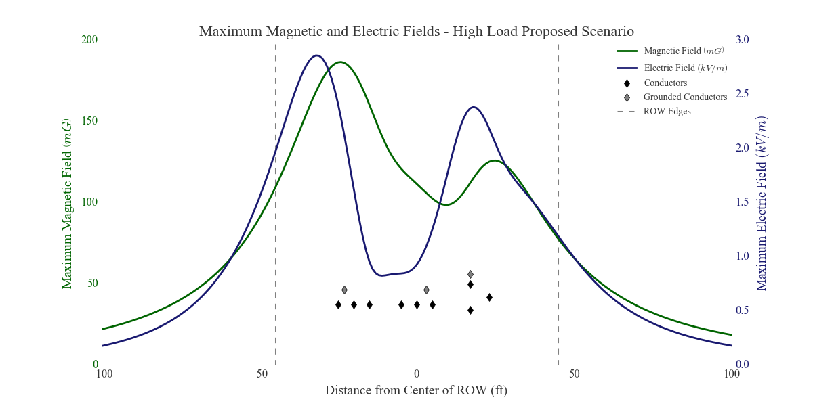
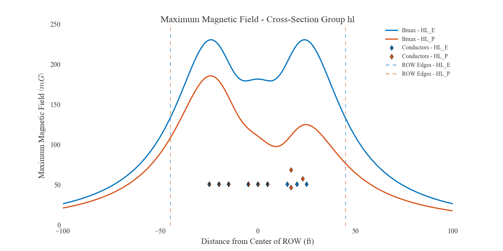
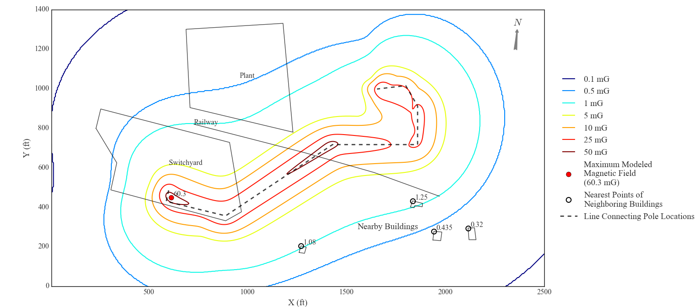

`emf`

The `emf` package contains two subpackages:
* `emf.fields` - Originally meant to streamline input/output and analysis of data used by the FIELDS program (discussed below), this package is now a wholesale replacement and extension of FIELDS. The `emf.fields` package:
  * reads data from excel templates and calculates theoretical electric and magnetic fields in the vicinity of parallel sets of power lines.
  * has functions to optimize the phasing of power line cross sections, generate plots of results, and calculate any additional power line height required to reduce fields to target values like regulatory thresholds
  * extends the capabilities of the old FIELDS program but still provides tools to make working with FIELDS faster
* `emf.subcalc` - This package manages the results of emf simulations performed by the SubCalc program (developed by [Enertech](http://www.enertech.net/html/emfw.html), sponsored by [EPRI](http://www.epri.com)), which calculates fields near non-parallel sets of power lines like substations.
  * It uses bilinear interpolation to approximate fields anywhere inside the grid of SubCalc results.
  * Reading from csv files, it stores the coordinates of footprints in the model domain like nearby structures, roads, or the power lines, and uses those coordinates to generate contour plots of the results with the footprints underlain and the maximum fields within the footprints shown

### More on `emf.fields`: Computing Electric and Magnetic Fields Near Parallel Sets of High Voltage Transmission Lines

This repo contains code for the approximation of electric and magnetic fields near parallel groups of power lines. It's meant to replace the old and difficult program called FIELDS, originally developed by Southern California Edison Co., which has been a standard tool for these simple modeling efforts. The FIELDS software runs through a DOSBOX application and is long out of date.

Using FIELDS requires manually entering cross section data into menus and tables of the DOSBOX app without even the ability to copy and paste, which is the slowest, most tedious, and most error-prone scenario possible. Once data is entered for a cross section, one navigates through several menus to run the calculations,which are output in files with .DAT extensions that often have formatting.FIELDS gives you the option to write the cross section data to an inscrutabletext file with a .FLD extension for later retrieval, so the data can be storedbut not in an editable form. FIELDS is only useful for performing thecalculations, but the rest of the program is an impediment.

This code is intended to exactly replicate the results of FIELDS calculations
and remove all of the frustrating parts of the program. The calculations followthe conceptual guidelines laid out in the Electric Power Research Institute's "Red Book" (some more information on this source below). The FIELDS source code isn't released, so a line-by-line replication of the calculations isn't possible. However, this version of the code has been able to reproduce FIELDS results to a very high degree of accuracy.

Some testing has shown error between this code and FIELDS results up to 3 %. I've been told by an engineer on the team that originally developed FIELDS that the FIELDS program runs 16-bit BASIC, lower precision than modern languages, and that BASIC has known accuracy issues with the sine and cosine functions. Additionally, the results of FIELDS simulations are saved to output files with the values rounded or truncated to the thousandths digit. These factors might explain the error. Nearly all testing has shown extremely small error, on the order of computational roundoff.

The FIELDS method of calculating EMF near transmission lines is not improved by this code. It seems like the FIELDS approach has a lot of inertia and is considered the standard tool. However, this code does significantly improve upon the usability and analytical capabilities of FIELDS by making the functions that calculate electric and magnetic fields accessible and building methods around them. This code mainly relies on:
* [data structures](http://pandas.pydata.org/pandas-docs/stable/dsintro.html#dataframe) and [I/O methods](http://pandas.pydata.org/pandas-docs/stable/io.html) from the [`pandas`](http://pandas.pydata.org/pandas-docs/stable/index.html) to interface with excel templates, store the results of fields simulations, and write results to output files
* [`numpy`](http://www.numpy.org/) arrays and functions to perform the actual fields calculations
* [`matplotlib`](http://matplotlib.org/) to generate plots of the simulation results
* three classes (`Conductor`, `CrossSection`, and `SectionBook`) to organize the imported data and the EMF results.

For the most routine modeling scenarios, this code enables a one line effort (after filling in template excel sheets) to generate full sets of electric and magnetic field results, double-axis plots of both electric and magnetic fields, plots comparing the electric and magnetic fields of grouped cross sections, and a table of maximum field magnitudes at the right-of-way (ROW) edges of each cross-section. The `run()` function does all this and only requires the path of the excel workbook of templates.

In addition to being quicker to use and more flexible than FIELDS, this code supplements the analytical capabilities of FIELDS with two methods.
* `emf.fields.optimize_phasing()` optimizes the phasing arrangement of selected conductors in a cross section by calculating fields for every possible phasing permutation at
the ROW edges. Conductors can be grouped into circuits of any size. Because it performs brute force testing of the ROW edge fields for all possible permutations
(and scales with a factorial), this method is slow when optimizing more than about five (three phase) circuits at a time.
* `emf.fields.target_fields()` finds any additional conductor height needed to bring maximum fields down to target levels. This method also allows for selection of specific conductors and uses a simple root finding method.

#### example plots

`emf.fields.plot_max_fields()`:

`emf.fields.plot_groups()`:

`emf.fields.plot_max_fields()`:

###### EPRI's "Red Book"

The editon of EPRI's "Red Book" that I worked from to replicate FIELDS calculations is titled "Transmission Line Reference Book: 345 kV and Above/Second Edition." Section 8.3 outlines the calculation of electric fields. Section 8.4 outlines the calculation of magnetic fields. Appendix 8.1 details how to calculate the maximum field magnitude from horizontal and vertical component phasors, which might sound almost trivial but is more involved than expected.
