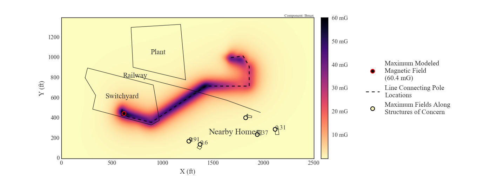
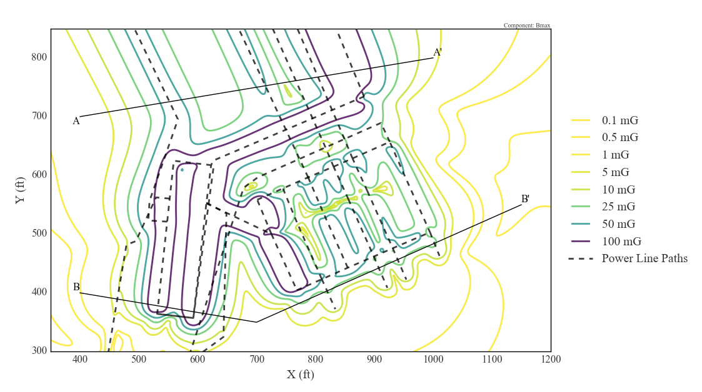
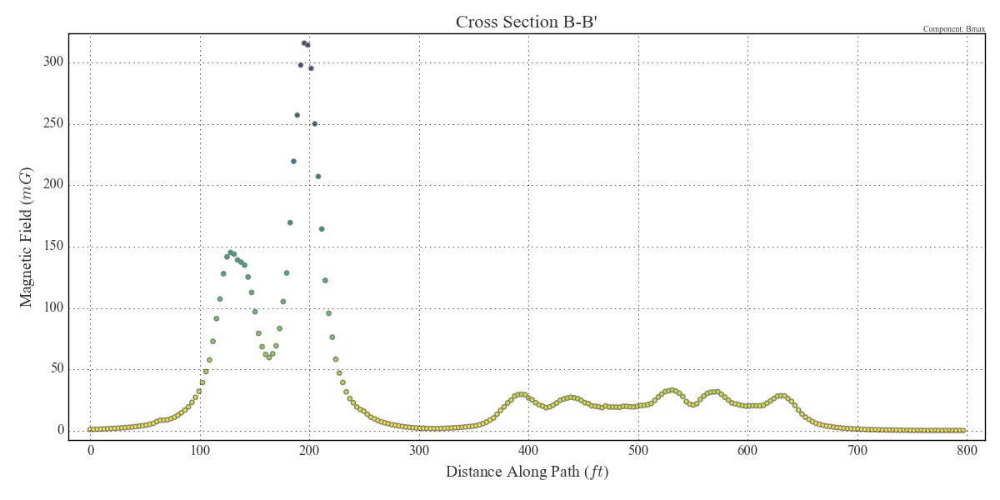

# `emf`

Documentation of `emf.subcalc` can be found [here](http://mbaum1122.github.io/emf/emf.subcalc.html)

### `emf.subcalc` vs SUBCALC

While the `emf.subcalc` package is capable of calculating the magnetic fields generated by complex, three dimensional arrangements of current carrying wire segments, it is not capable of calculating fields generated by other electrical equiment like buses, circuit breakers, power transformers, air core reactors, and capacitor banks. The [SUBCALC](http://www.enertech.net/html/emfw.html) program, which `emf.subcalc` emulates and interfaces with, is capable of modeling that equipment. The SUBCALC program also provides a GUI enabling a user to draw towers onto a map view of a model domain and edit the wire configurations of each tower. The GUI is generally helpful for creating small models, but it can be frustrating when creating more complicated models and when creating different versions of the same model.
`emf.subcalc` provides no GUI and would certainly be harder to learn, but it can perform the calculations that most modeling scenarios require and it provides better analysis and plotting methods than SUBCALC.

Importantly though, the old SUBCALC program is not free. It's not terribly expensive, but one must navigate an annoying web of contacts and phone calls to get a yearlong license. In several tests, `emf.subcalc` has produced the exact same results as SUBCALC for the same inputs.

#### Example `emf.subcalc` plots

Contour plot of SUBCALC magnetic field results and structures of interest using `emf.subcalc.plot_contours`, where the contours are colored on a logarithmic scale using the "viridis" colormap:

A heatmap or colormesh plot of the same SUBCALC results again, using `emf.subcalc.plot_pcolormesh`:

Another heatmap using results from the same model as above, but with only the
horizontal (x) component of the magnetic field plotted, and using the "magma" colormap.

Finally, a contour plot of substation model results with two cross sections drawn on it. The fields along the cross sections are shown in the two subsequent plots. All three plots were automatically generated.

