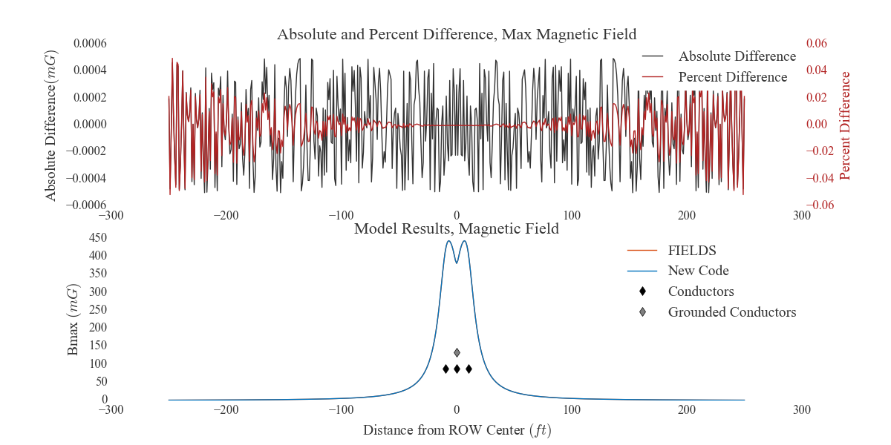
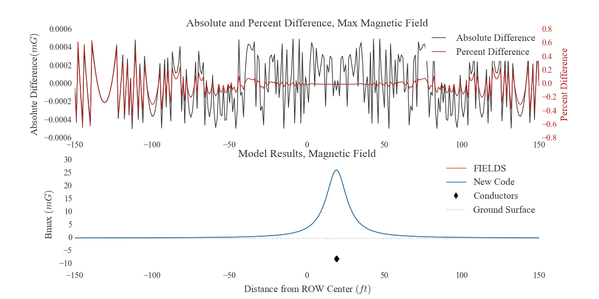
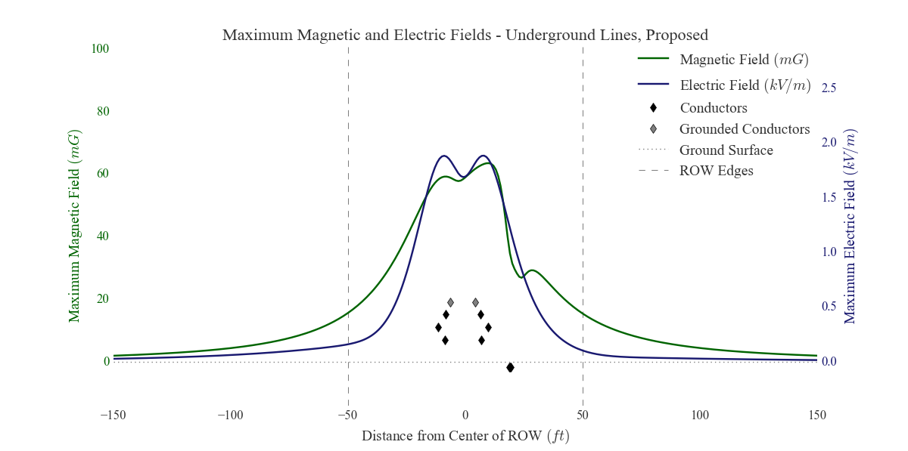
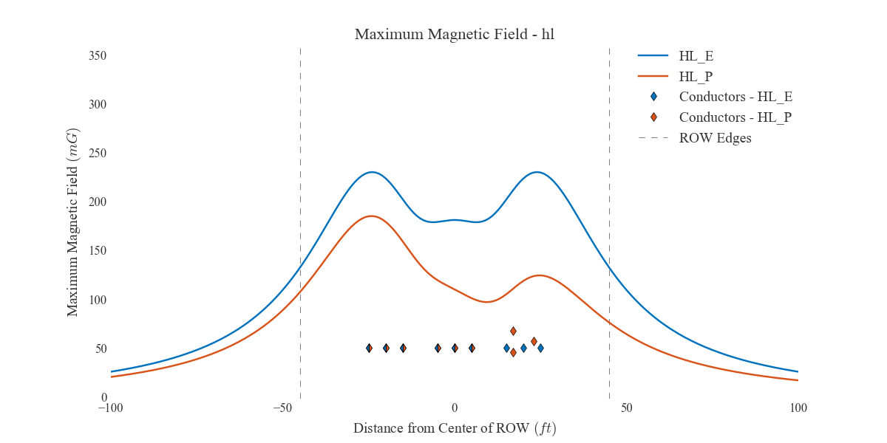
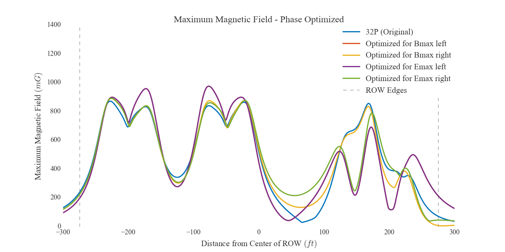
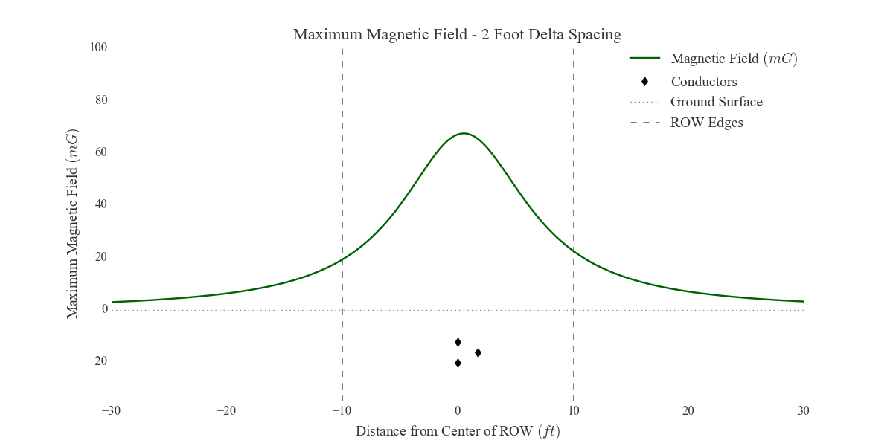
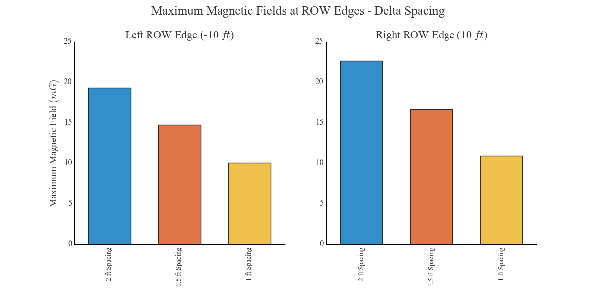

# `emf.fields`

Documentation of `emf.fields` can be found [here](http://mbaum1122.github.io/emf/emf.fields.html)

### `emf.fields` vs FIELDS

`emf.fields` was originally a small stand-alone package that streamlined the use of an old electromagnetic field (EMF) modeling program called FIELDS. That old program predicts electric and magnetic fields near parallel sets of power lines by assuming the conductors are infinitely long and computing the fields along a transect perpendicular to the power lines (a cross section model). The old FIELDS program is very difficult to use (details below), so it made sense to transplant as much of the modeling process as possible into other programs. So, `emf.fields` was initially an extension of the old FIELDS program that made it easier to work with the modeling files and do things like plot the results. In its first versions, `emf.fields` was used to read power line information from specially formatted excel templates, create input files that could be used by FIELDS to compute EMF results, then manage the FIELDS results. The package did everything except perform the actual EMF calculations. In its current versions, `emf.fields` still contains functions streamlining the use of FIELDS *and* it performs all of the necessary calculations on its own. It also has a significant amount of fuctionality that FIELDS lacks, like functions to optimize the phasing arrangement of a cross section model, compute conductor heights needed to lower fields to target levels, and create a handful of different plots. For someone that knows a little Python, `emf.fields` is signifantly more flexible and more powerful than the old FIELDS program. Documentation of `emf.fields` can be found [here](http://mbaum1122.github.io/emf/emf.fields.html).

The main problems with FIELDS:
* Using the program requires navigating through lots of menus with semi-responsive buttons, requiring manual entry of cross section data into menus and tables of the DOSBOX app without even the option to copy and paste. Building cross section models in FIELDS is slow, tedious, and error prone.
* Once a cross section is built in FIELDS, it's very difficult to refer to the input data because FIELDS saves model information to nearly inscrutable text files with `.FLD` extensions, like in [this](other/32P.FLD) file. These files also force users to re-navigate the frustrating series of menus to edit cross section input.
* Causing further annoyance, the program traps the mouse, meaning other applications can't be used at the same time unless an escape button is pressed first (the Windows button on Windows).
* Model resolution/extent are limited in FIELDS, with a maximum of 602 samples.
* Results are output to delimited files with `.DAT` extensions, but these files contain results rounded/truncated to three digits and often have formatting complications or printing errors. For example, numbers that require more than four digits to the left of a decimal (including negative signs, like -1233.0) are printed on their own lines with "%" in front of them for some reason, [like so](other/32P.DAT). (`emf.fields.read_DAT` is a function that will read these output files into [DataFrames](http://pandas.pydata.org/pandas-docs/stable/generated/pandas.DataFrame.html) and handle all of their known eccentricities, a function mostly leftover from when `emf.fields` couldn't do EMF calculations on its own.)
* Nothing is scriptable. Any changes require re-navigating the menus, `.FLD` files, and `.DAT` files.

FIELDS is useful for performing the EMF calculations, but the rest of the program is an impediment.

`emf.fields` performs the same calculations as FIELDS, but removes the frustrating issues listed above (for a person who knows a little Python). The FIELDS source code isn't released, so a line-by-line replication of its calculations isn't possible, but `emf.fields` produces nearly identical results for the same input. The calculations follow the conceptual guidelines laid out in the Electric Power Research Institute's "Red Book" (some more information on this source below).

Comparisons between FIELDS results and `emf.fields` results have shown error on the order of FIELDS output roundoff (rounded/truncated to thousandths digit) in almost all cases. The plot below shows FIELDS results and results of this code for the same cross section. They can't be distinguished by eye and the error is clearly not systematic. Notice that the magnitude of the error is never more than 0.0005 mG, exactly what one expects if one set of results is only recorded to a maximum precision of 0.001 mG.

`emf.fields` also reproduces nearly identical results for underground conductors, as shown below.

An engineer on the team that originally developed FIELDS said that the FIELDS program runs 16-bit BASIC, lower precision than modern languages, and that BASIC has known accuracy issues with the sine and cosine functions (used at several points in the calculations). Additionally, because the results of FIELDS simulations are saved to output files with the values rounded or truncated to the thousandths digit, significant precision can be lost simply by exporting. Thus far, all discrepancies between FIELDS results and the results of `emf.fields` can reasonably be attributed to rounding in the FIELDS results when the field magnitudes are low and possibly to trigonometry inaccuracies in BASIC.

### Using `emf.fields`

The `emf.fields` subpackage is fully documented [here](http://mbaum1122.github.io/emf/emf.fields.html). It uses three classes to organize models into hierarchies of objects, which are easy to manipulate for any modeling objectives:
* `Conductor` - Low level class representing a single power line (or conductor bundle) and storing fundamental information like position, voltage, etc.
* `CrossSection` - Stores and organizes groups of `Conductor` objects, providing dictionary-like access to them. Also stores modeling information (like step size, model extents, etc.), the results of EMF calculations (in [DataFrames](http://pandas.pydata.org/pandas-docs/stable/generated/pandas.DataFrame.html)), and more.
* `SectionBook` - Top level class that stores `CrossSection` objects, provides dictionary-like access to them, maintains a table of EMF values at all its child `CrossSections`'s ROW edges, provides exporting methods, and more.

For modeling batches of cross sections, the package enables a one line effort (after filling in template excel sheets, which can be copied out of the package with `emf.drop_template`) to generate:
* full sets of electric and magnetic field results along each cross section
* a table of maximum field magnitudes at the right-of-way (ROW) edges of each cross-section
* double-axis plots of both electric and magnetic fields
* plots comparing the electric and magnetic fields of grouped cross sections over their entire domain
* bar charts showing the fields of grouped cross sections at ROW edges

The `emf.fields.run` function does all of that and only requires the path of an excel workbook of templates. Templates can also be loaded into `SectionBook` objects for more targeted output using the `emf.fields.load_template` function. An brief example showing how a template is used can be found [here](https://github.com/mbaum1122/emf/blob/master/docs/notebooks/fields/using-a-template.ipynb). Alternatively, cross section models can be built entirely in Python, as [this notebook](https://github.com/mbaum1122/emf/blob/master/docs/notebooks/fields/fields-workflow-from-scratch.ipynb) demonstrates in an explicit manner and [this other notebook](https://github.com/mbaum1122/emf/blob/master/docs/notebooks/fields/underground-line-optimization.ipynb) demonstrates with fewer comments.

In addition to being quicker to use and more flexible than FIELDS, this code furthers the analytical capabilities of FIELDS with two methods.
* `emf.fields.optimize_phasing` optimizes the phasing arrangement of selected conductors in a cross section by calculating fields for every possible phasing permutation at the ROW edges. Conductors can be grouped arbitrarily into circuits (usually groups of three for three-phase circuits). Because this method performs brute force testing of the ROW edge fields for all possible permutations and scales poorly, it's slow when optimizing more than about five (three phase) circuits at a time, but CrossSections with more than a few circuits are very rare.
* `emf.fields.target_fields` finds any additional conductor height needed to bring maximum fields down to target levels. This method also allows for selection of specific conductors and uses a simple root finding method, increasing the height of selected conductors and reevaluating theoretical fields at right-of-way (ROW) edges until the desired precision is achieved.

Finally, `emf.fields` has several plotting functions that work on `CrossSection` and `SectionBook` objects. Some examples are below.

#### Example `emf.fields` plots

Simulated maximum electric and magnetic fields across a ROW, with the field magnitudes on split vertical axes, using `emf.fields.plot_max_fields`. Conductor positions are shown in true horizontal units but false/scaled vertical units:

Comparison of simulated magnetic field profiles of two related cross sections, essentially a before-and-after plot, using `emf.fields.plot_groups`. This plot shows that switching the rightmost circuit to a "delta" configuration reduces fields significantly:

A comparison of the results of phase optimization through `emf.fields.optimize_phasing`, using `emf.fields.plot_groups` again. The plot shows magnetic field profiles for each of the four optimization scenarios (optimize for electric field on the left side, electric field on the right, magnetic on the left, and magnetic on the right). Notably, optimization for magnetic fields at the right ROW edge reduces fields quite significantly (about 88 %):

A plot showing simulated magnetic fields due to an underground group of three conductors, arranged in a triangular or "delta" configuration with 2 feet between the conductors.

If the conductors in the plot above are moved closer together, the simulated magnetic fields decrease. The bar charts below show decreasing field values at both ROW edges due to decreasing conductor spacing. Interestingly, there appears to be a roughly linear relationship between the maximum field strength and the conductor spacing. The plot was generated with `emf.fields.plot_groups_at_ROW`:

These plots were all automatically generated.

###### EPRI's "Red Book"

The edition of [EPRI](http://www.epri.com)'s "Red Book" that I worked from to replicate FIELDS calculations is titled "Transmission Line Reference Book: 345 kV and Above, Second Edition." Section 8.3 outlines the calculation of electric fields. Section 8.4 outlines the calculation of magnetic fields. Appendix 8.1 details how to calculate the maximum field magnitude from horizontal and vertical component phasors, which might sound almost trivial but is more involved than expected.
