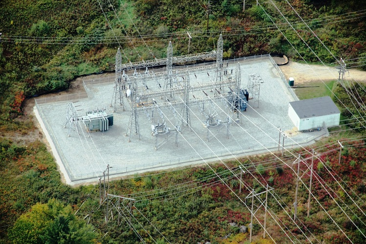
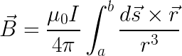

# `emf.subcalc`

Documentation of `emf.subcalc` can be found [here](http://mbaum1122.github.io/emf/emf.subcalc.html)

### `emf.subcalc` vs SUBCALC

`emf.subcalc` was originally intended to supplement/extend the use of another modeling program. In this case, the other modeling program is [SUBCALC](http://www.enertech.net/html/emfw.html) (developed by [Enertech](http://www.enertech.net/html/emfw.html), sponsored by [EPRI](http://www.epri.com)). SUBCALC predicts magnetic fields over a fixed-height 2 dimensional grid and can model many non-parallel segments of power lines. It is generally used to model magnetic fields near electrical substations, where circuit arrangements can be complex. Just like `emf.fields`, `emf.subcalc` is now a complete replacement of the program it was originally intended to supplement. Although it provides no fancy UI, `emf.subcalc` is capable of calculating the magnetic fields produced by complex, three dimensional arrangements of current carrying wire segments. It is also able to generate results for an arbitrary set of points in 3 dimensions, where SUBCALC requires to user to recalculate an entire grid of results and interpolate it for precise sampling. The flexibility to calculate fields at any set of points can make some tasks much more efficient, like getting a dense set of samples along a fenceline to make nice looking plots. Documentation of `emf.subcalc` can be found [here](emf.subcalc.html).

While the `emf.subcalc` package is capable of calculating the magnetic fields generated by complex, three dimensional arrangements of current carrying wire segments, it is not capable of calculating fields generated by other electrical equiment like buses, circuit breakers, power transformers, air core reactors, and capacitor banks. The [SUBCALC](http://www.enertech.net/html/emfw.html) program, which `emf.subcalc` emulates and interfaces with, is capable of modeling that equipment. The SUBCALC program also provides a UI enabling a user to draw towers onto a map view of a model domain and edit the wire configurations of each tower. The UI can helpful for creating small models, but it can be frustrating when creating more complicated models and when creating slightly different versions of the same model.
`emf.subcalc` provides no UI and would certainly be harder to learn, but it can perform the calculations that most modeling scenarios require and it provides better analysis and plotting methods than SUBCALC.

Importantly though, the old SUBCALC program is not free. It's not terribly expensive either, but one must navigate an annoying web of contacts and phone numbers to get an annually renewed license. In several tests, `emf.subcalc` has produced the exact same results as SUBCALC for the same inputs.

### Using `emf.subcalc`

The `emf.subcalc` package is centered on two classes, `Model` and `Results`.

* `Model` objects contain information about where power lines are and about where to calculate magnetic fields. The locations of power lines are defined by two different classes, `Tower` and `Conductor`.
  * Groups of `Tower` objects are used to define the paths of wires through the grid by giving each `Tower` an x coordinate, a y coordinate, a rotation angle, and wire positions relative to the `Tower`. The `Model` object automatically computes the paths of wires running between `Towers`in x,y,z coordinates.
  * `Conductor` objects can be used to directly specify the path of a wire in x,y,z coordinates
Magnetic fields are calculated from `Model` objects by running `Model.calculate()`, which returns a `Results` object containing a grid of fields results, or by running `Model.sample()`, which can be used to get fields at an arbitrary set of coordinates in 3D.

* The `Results` class is used to analyze and plot the magnetic field results. It has a number of methods for interpolating and manipulating the grid of results and `Results` objects are passed directly to the plotting functions. Additionally, `Footprint` objects can be added to `Results` objects to include objects of interest in the plotted results (houses, fences, the paths of power lines, etc.).

Generally, using `emf.fields` requires creating `Conductor` and `Tower` objects, putting them in a `Model` object, and running the `calculate` method to generate a `Results` object. Most modeling will only call for the use of `Tower` objects, so there is an excel/csv template for storing `Tower` information and loading it into `Model` objects. To generate the template, use the `drop_tower_template` function. After the template has been filled out, `Tower` objects can be read from it with the `load_tower` function.

There is also a template for `Footprint` objects, which can be generated with `drop_footprint_template`. It's easy to associate `Footprint` objects with a `Results` object, using the `load_footprints` method of the `Results` class.

### Working with SUBCALC files

In the old SUBCALC program, input data can be saved to files with "INP" extensions and results can be saved to files with "REF" extensions. Both INP and REF files contain formatted text and can be read by `emf.subcalc` functions to easily compare results from the programs and make the SUBCALC results more accessible.
* The input data of a SUBCALC model can be parsed from an INP file into `Tower` objects with the `load_towers` function. This function can optionally return a `Model` object containing the `Tower` objects.
* Results of a SUBCALC model can be read from a REF file into a `Results` object with the `load_results` function. The function pulls out all components of the magnetic field results (x, y, z, res, and max) and the metadata at the beginning of the file.
* To simply convert the results of a SUBCALC model from a REF file into a smaller and more readable excel file, use the `convert_REF` function.

### Example `emf.subcalc` plots

Generating better plots than the built-in SUBCALC plots is a focus of `emf.subcalc`. Some examples are shown below.

A heatmap (colormesh) plot showing the horizontal (x) component of the magnetic field, using the "magma" colormap.

A contour plot of substation model results with two cross sections drawn on it. The fields along the cross sections are shown in the two subsequent plots. All three plots were automatically generated.

